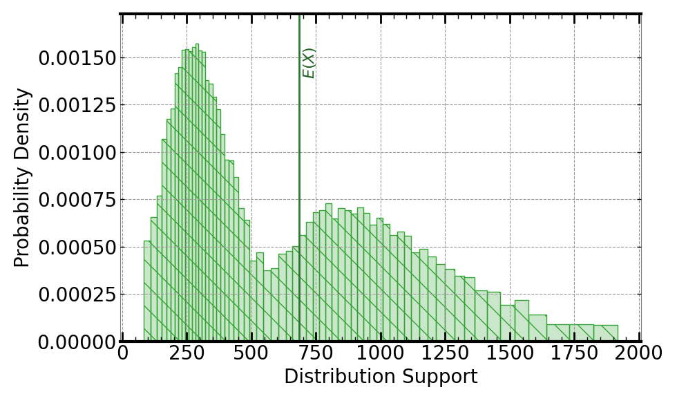

[](https://signaloid.io/repositories?connect=https://github.com/signaloid/Signaloid-Demo-Metallurgy-BrownHamModel#gh-dark-mode-only)
[](https://signaloid.io/repositories?connect=https://github.com/signaloid/Signaloid-Demo-Metallurgy-BrownHamModel#gh-light-mode-only)

# Precipitate Dislocation Model from Brown and Ham Exploiting the Signaloid Compute Engine
This example implements the equation for a materials precipitate "cutting" dislocation model from
Brown and Ham[^brown-ham-ref] and shows how metallurgists can gain insight into the uncertainty of
a model of a metal alloy's strength. The example highlights how the Signaloid C0 processor allows
you to take unmodified programs and track uncertainty through them[^usage], getting all the benefits
that you would usually only be able to obtain from a hand-crafted (and time-consuming) Monte Carlo
evaluation. This demo exemplifies how uncertainties in empirical model parameters affect the uncertainty
distribution of the model's output, for a model of a physical process.

## Getting started
The correct way to clone this repository to get the submodules is:
```sh
	git clone --recursive git@github.com:signaloid/Signaloid-Demo-Metallurgy-BrownHam.git
```

If you forgot to clone with `--recursive` and end up with empty submodule directories, you can remedy this with:
```sh
	git submodule update --init
```

## Running the application on the Signaloid Cloud Developer Platform
To run this application on the [Signaloid Cloud Developer Platform](https://signaloid.io),
you need a Signaloid account. You can sign up for a Signaloid account using [this link](https://get.signaloid.io).

Once you have a Signaloid account, you can click the "add to signaloid.io" button at the
top of this `README.md` to connect this repository to the Signaloid Cloud Developer Platform
and run the application.

## Running the application locally
Apart from using Signaloid's Cloud Compute Platform, you can compile and run this application
locally. Local execution is essentially a native Monte Carlo implementation,
that uses GNU Scientific Library[^GSL] to generate samples for the different input distributions.
In this mode the application stores the generated output samples, in a file called `data.out`.
The first line of `data.out` contains the execution time of the Monte Carlo implementation
in microseconds (μs), and each next line contains a floating-point value corresponding to an output sample value.

In order to compile and run this application in the native Monte Carlo mode:

0. Install dependencies (e.g., on Linux):
```
sudo apt-get install libgsl-dev libgslcblas0
```
1. Compile natively (e.g., on Linux):
```
cd src/
gcc -I. -I/opt/local/include main.c utilities.c common.c uxhw.c -L/opt/local/lib -o native-exe -lgsl -lgslcblas -lm
```
2. Run the application in the MonteCarlo mode, using (`-M`) command-line option:
```
./native-exe -M 10000
```
The above program runs 10000 Monte Carlo iterations.
3. See the output samples generated by the local Monte Carlo execution:
```
cat data.out
```

## Inputs
The inputs and their distributions are:
- `gamma`:	Uniform($0.15, 0.25$)
- `phi`:    Uniform($0.30, 0.45$)
- `Rs`:		Equal mixure of Gaussian($10^{-8}, 2 \times 10^{-9}$) and Gaussian($3 \times 10^{-8}, 2 \times 10^{-9}$)
- `G`:		Uniform($6 \times 10^{10}, 8 \times 10^{10}$)
- `b`:		$2.54 \times 10^{-10}$ (i.e., constant)
- `M`:		Uniform($1.9, 4.1$)

The parameter `gamma` is the APB energy with units J/m^2, `phi` is the precipitate volume fraction,
`Rs` is mean particle radius on plane with units m, `G` is the shear modulus with units Pa,
`b` is the magnitude of the Burgers vector with units m, and `M` is the Taylor factor.

## Outputs
The output is the cutting stress, $\sigma_c$, where
$$
\sigma_c = \left( \frac{M \cdot \gamma}{2.0 \cdot b} \right) \cdot
\left( \sqrt{\frac{8.0 \cdot \gamma \cdot \phi \cdot Rs}{\pi \cdot G \cdot b^2}} - \phi \right).
$$

Following is an example output, using Signaloid's C0Pro-XS+ core, for the default inputs:



## Usage
```
Example: Precipitate Dislocation Model from Brown and Ham - Signaloid version

Usage: Valid command-line arguments are:
        [-o, --output <Path to output CSV file : str>] (Specify the output file.)
        [-M, --multiple-executions <Number of executions : int> (Default: 1)] (Repeated execute kernel for benchmarking.)
        [-T, --time] (Timing mode: Times and prints the timing of the kernel execution.)
        [-v, --verbose] (Verbose mode: Prints extra information about demo execution.)
        [-b, --benchmarking] (Benchmarking mode: Generate outputs in format for benchmarking.)
        [-j, --json] (Print output in JSON format.)
        [-h, --help] (Display this help message.)
        [-g, --apb-energy <gamma: double> (Default: Uniform(0.15, 0.25))] (Set `gamma` variable.)
        [-p, --precipitate-volume-fraction <phi: double> (Default: Uniform(0.30, 0.45))] (Set `phi` variable.)
        [-R, --mean-particle-radius <Rs: double> (Default: UxHwDoubleMixture(Gauss(1.0e-08, 2.0e-09), Gauss(3.0e-08, 2.0e-09), 0.5))] (Set `Rs` variable.)
        [-G, --shear-modulus <G: double> (Default: Uniform(6.0e+10, 8.0e+10))] (Set `G` variable.)
        [-B, --burgers-vector <b: double> (Default: 2.54e-10)] (Set `b` variable.)
        [-m, --taylor-factor <M: double> (Default: Uniform(1.9, 4.1))] (Set `M` variable.)
```

## Acknowledgements
We learned about the Brown and Ham model from Prof. Hector Basoalto[^ack-ref] of the University of Sheffield. We are most
grateful to him and his team for guiding us through the ideas and evaluating our initial implementation in this example.


<br/>
<br/>
<br/>

[^brown-ham-ref]: Brown, L. M., and R. K. Ham. "Dislocation-particle interactions." Strengthening methods in crystals (1971): 9–135.

[^usage]: Running this example on the Signaloid C0-Cloud processor uses less than 1% of the free monthly credits on the
Signaloid C0-Cloud Free Tier plan.

[^GSL]: [GNU Scientific Library](https://www.gnu.org/software/gsl/).

[^ack-ref]: M.J. Anderson, F. Schulz, Y. Lu, H.S. Kitaguchi, P. Bowen, C. Argyrakis, and H.C. Basoalto. 2020. On the modelling of
precipitation kinetics in a turbine disc nickel based superalloy. Acta Materialia 191 (2020), 81–100. https://doi.org/10.1016/j.actamat.2020.03.058.
